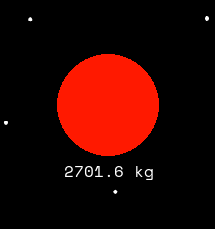
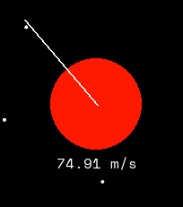

# grav-sim

A 2D gravity simulation built with python and pygame.

I tried to build it from scratch as much as I could, so it uses its own physics engine with collision mechanics

The sim has been built before this git repo was created, but it has been heavily expanded upon and modified

You can play the web version of the sim [here](https://anayksha.itch.io/grav-sim) on itch.io

## Controls

### Creating Bodies

To initially create a Body, click, hold, and drag to add a body and set its mass. Release the left mouse button when the desired mass has been set

Then a line will appead from the center of the body to the mouse position. Click anywhere in the window to set the Body's initial velocity.
The length of the line corresponds with the speed, and the angle with the direction

### Other Things

- **Camera pan:** WASD
- **Camera zoom:** scroll wheel
- **Toggling Visual Velocity and Acceleration Vectors:** V

## Acknowledgements

Space Mono is a font by Colophon Foundry for Google Design (https://github.com/googlefonts/spacemono) licensed under the [SIL Open Font License v1.1](https://openfontlicense.org/open-font-license-official-text/)

Thx to [JoelBiswas](https://github.com/JoelBiswas) for some of the continuous collision resolution physics

Thx to [Chris Hecker](https://www.chrishecker.com/Rigid_Body_Dynamics) and [Two-Bit Coding](https://www.youtube.com/@two-bitcoding8018) for the physics behind collision reactions